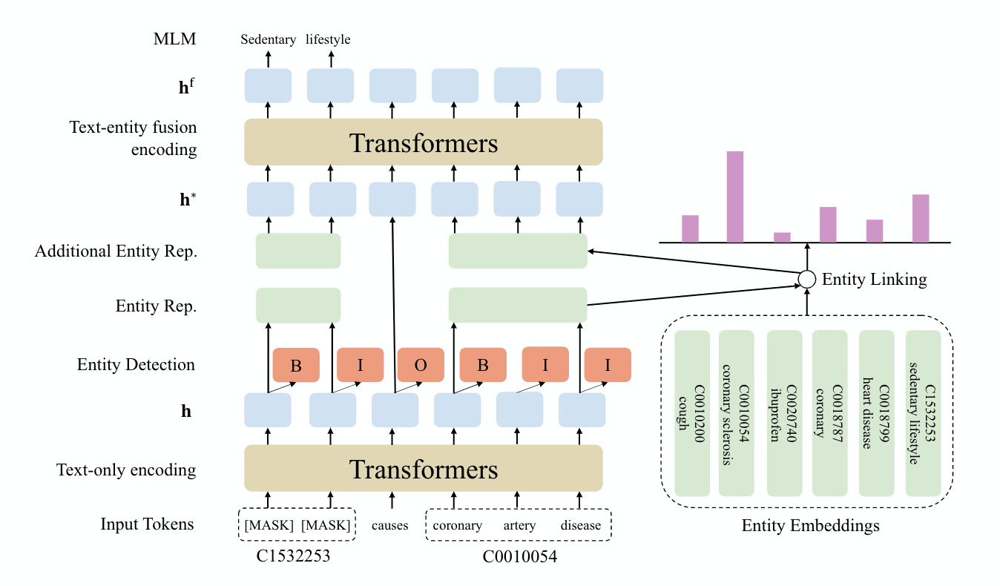

# KeBioLM
Improving Biomedical Pretrained Language Models with Knowledge.
Accepted by BioNLP 2021.
[Paper](https://arxiv.org/abs/2104.10344)

# Introduction

KeBioLM: **K**nowledge **e**nhanced **Bio**medical pretrained
**L**anguage **M**odel

KeBioLM applies text-only encoding layer
to learn entity representation and applies a
text-entity fusion encoding to aggregate entity
representation.
KeBioLM has three pretraining tasks: 
- Masked Language Model: Extend whole word masking to whole entity masking.
- Entity Detection: Predict B/I/O tags for NER.
- Entity Linking: Link predicted entities to UMLS.

# Pre-trained Model
You can download our model from [Google Drive](https://drive.google.com/file/d/1kMbTsc9rPpBc-6ezEHjMbQLljW3SUWG9).
Our model contain pre-trained weights `pytorch_model.bin`, a tokenizer `vocab.txt` (same as PubMedBERT) and an entity dictionary for entity linking task in pretraining phase `entity.jsonl`.

# Environment
All codes are tested under Python 3.7, PyTorch 1.7.0 and Transformers 3.4.0.

# Fine-tune KeBioLM for NER and RE

## BLURB Dataset
Download BLURB dataset from [here](https://microsoft.github.io/BLURB/sample_code/data_generation.tar.gz).

## NER
For example, to fine tune BC5CDR-disease dataset:
```sh
cd ner
CUDA_VISIBLE_DEVICES=0 python \
run_ner.py \
--data_dir $BC5CDR_DATASET \
--model_name_or_path $KEBIOLM_CHECKPOINT_PATH \
--output_dir $OUTPUT_DIR \
--num_train_epochs 60 \
--do_train --do_eval --do_predict --overwrite_output_dir \
--gradient_accumulation_steps 2 \
--learning_rate 3e-5 \
--warmup_steps 1710 \
--evaluation_strategy epoch \
--max_seq_length 512 \
--per_device_train_batch_size 8 \
--eval_accumulation_steps 1 \
--load_best_model_at_end --metric_for_best_model f1
```

To use your own task for fine-tuning, please prepare `train.tsv`, `test.tsv` and `dev.tsv` in same folder.
If your task contain tags more than *B,I,O* like *B-disease, I-disease*, please also provide a label file which contains each label in a line:
```
O
B-disease
I-disease
B-symptom
I-symptom
```
And you should pass this label file by `--labels $label_file`.

## RE
To fine-tune DDI dataset:
```sh
cd re
CUDA_VISIBLE_DEVICES=0 python \
run.py \
--task_name ddi \
--data_dir $DDI_DATASET \
--model_name_or_path $KEBIOLM_CHECKPOINT_PATH \
--output_dir $OUTPUT_DIR \
--num_train_epochs 60 \
--do_train --do_eval --do_predict --overwrite_output_dir \
--gradient_accumulation_steps 1 \ 
--learning_rate 1e-5 \
--warmup_steps 9486 \
--evaluation_strategy epoch \
--max_seq_length 256 \
--per_device_train_batch_size 16 \
--eval_accumulation_steps 1 \ 
--load_best_model_at_end --metric_for_best_model f1
```
Since DDI, ChemProt and GAD dataset have different formats and labels, we should specific `--task_name ddi/chemprot/gad`.

## Hyperparameters for BLURB dataset
To reproduce the results of our paper, please try training models with following hyperparameters.
All models are trained for 60 epochs with a 10% steps linear warmup.

| Dataset  | Learning rate | Sequence Length | Batch size | Gradient accumulation |
| :------: | :-----------: | :-------------: | :--------: | :-------------------: |
| BC5chem  |     3e-5      |       512       |     8      |           2           |
|  BC5dis  |     1e-5      |       512       |     8      |           2           |
|   NCBI   |     1e-5      |       512       |     8      |           2           |
|  BC2GM   |     3e-5      |       512       |     8      |           2           |
|  JNLPBA  |     1e-5      |       512       |     8      |           2           |
| ChemProt |     1e-5      |       256       |     16     |           1           |
|   DDI    |     1e-5      |       256       |     16     |           1           |
|   GAD    |     1e-5      |       128       |     16     |           1           |
BC2GM, GAD and DDI datasets have relatively higher variance, you can try different seeds by setting `--seed $seed_number`.

# UMLS Knowledge Probing
For a relation triplet `(s, r, o)` in UMLS, we generate two queries: `[CLS] [MASK] r o [SEP]` and `[CLS] s r [MASK] [SEP]`.
We request language models to restore the masked entites.
We collect 143771 queries for 922 relation types.

## Rebuild the dataset
To rebuild our dataset for UMLS knowledge probing, you should prepare [UMLS2020AA](https://www.nlm.nih.gov/research/umls/licensedcontent/umlsarchives04.html#2020AA) version.
After installing UMLS2020AA, you should have a folder `$UMLS_DIR` with `MRCONSO.RRF`, `MRREL.RRF`, `MRSTY.RRF`.
Using `probe/build.py` to rebuild the probing dataset `dataset.txt` based on UMLS LUI and relation.
```sh
cd probe
python build.py $UMLS_DIR
```
Rebuilding process will take about 10 minutes.

## Probing
The default setting of probing is `max_length_of_[MASK] = 10`, `beam_width = 5`.
To probe `dataset.txt` for SciBERT (or other Bert-based language models):
```sh
cd probe
python beam_batch_decode.py $SCIBERT_PATH dataset.txt
```
To probe `dataset.txt` for KeBioLM:
```sh
cd probe
python beam_batch_decode.py $KEBIOLM_CHECKPOINT_PATH dataset.txt
```
Probing with `beam_width = 5` will take very long time (over 1 day on V100), you may split `dataset.txt` for using multi GPUs to decode.

To perform evaluation on probing results, using:
```sh
cd probe
python metric.py $predict_file dataset.txt $UMLS_DIR
```
